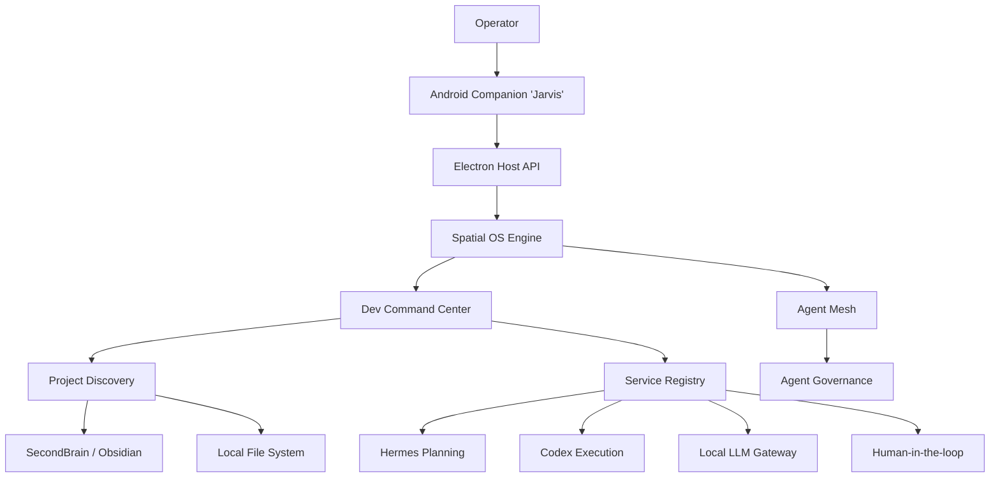

# NiClaw System Architecture

## 1. Executive Summary

### What is NiClaw?
NiClaw is a localized Agentic Operating System. It is an evolution of spatial computing tailored for AI agents, designed to act as a central nervous system for executing, monitoring, and governing autonomous AI workflows on Windows, while keeping the human in the loop via a companion Android application (Jarvis).

### Scope and Purpose
The goal of NiClaw is to bridge the gap between human intent and machine execution by replacing traditional IDE scripting with autonomous agents. It acts as an orchestrator that plans, delegates, and executes complex tasks across multiple projects locally, utilizing an AI-native workspace.

### Core Problems Solved
- **Fragmentation of AI Execution:** Centralizes AI capabilities (OpenClaw, Hermes, Codex) into a single governance mesh.
- **Lack of Trust in Autonomous Code:** Implements an "Open-Human" approval loop to stop reckless code execution, requiring explicit human sign-off before any changes are pushed.
- **Context Loss:** Deeply integrates with Obsidian (SecondBrain) to ensure the AI always acts on canonical, up-to-date documentation.

### Primary Users
- **AI Operators/Developers:** Developers who want to transition from manual coding to managing swarms of specialized AI agents.

### Long-Term Vision
To evolve into a fully unified Spatial OS capable of dynamically rewriting its own capabilities, routing complex tasks to specialized sub-agents, and acting as an autonomous developer managed solely via voice and high-level intent from mobile.

---

## 2. High Level Architecture

### Components
- **Android Companion (Jarvis):** The mobile control surface. Handles approvals, push notifications, and quick task submissions via voice/text.
- **Desktop App (React/Vite):** The visual representation of the Spatial OS, featuring nodes, memory traces, and agent visualization.
- **Electron Host & Host API:** The secure Node.js backend acting as the bridge between the local filesystem, APIs, and the frontend.
- **Spatial OS:** The conceptual environment managing memory promotion, dreams, and continuous state across sessions.
- **Agent Mesh:** A network of specialized agents capable of peer-to-peer communication to solve tasks.
- **Dev Command Center:** The task orchestration engine. Handles structural parsing, planning, validation, and simulated execution.
- **SecondBrain (Obsidian):** The localized vectorless knowledge graph storing canonical project truths and developer journals.
- **Hermes / Codex / OpenClaw:** Extensible services for prompt planning, repository-wide execution, and local LLM routing.

---

## 3. Repository Structure

### `C:\Server\niclaw\app`
**Scope:** Core Electron Desktop App and Backend Host API.
- `src/` - React frontend (Vite).
    - `pages/` - UI routes (CommandCenter, AgentMesh, SpatialOS).
    - `components/` - Reusable UI widgets.
- `electron/` - Backend Node.js services.
    - `api/` - Host API definitions (e.g., `/routes/orchestrator.ts`).
    - `services/` - Core logic (`task-orchestrator.ts`, `obsidian-memory.ts`).
    - `main/` - Electron lifecycle management.

### `C:\Server\niclaw\niclawjules\android`
**Scope:** The Android Companion app.
- `app/src/main/java/com/jarvis/`
    - `MainActivity.kt` - Main view handling intents.
    - `JarvisClient.kt` - Network layer communicating with Host API.
    - `MessageAdapter.kt` - UI list logic.

---

## 4. Frontend Architecture

### Android (Jarvis)
- **Activities:** `MainActivity` serves as the single activity architecture.
- **Navigation:** Basic layout-based switching (to be upgraded to Jetpack Navigation).
- **State Management:** Native Kotlin properties and manual UI invalidation (MVP stage).
- **API Layer:** `JarvisClient` handles asynchronous HTTP requests to `http://<tailscale-ip>:13210/api/orchestrator/`.

### Desktop (React/Vite)
- **Routes/Pages:** Mapped to visual modes (`CommandCenter`, `AgentMesh`, `Dreams`).
- **State Management:** Uses Zustand for global state and React Query for API data fetching.
- **Components:** Modular Tailwind UI components emphasizing spatial layout (e.g., infinite canvas for Mesh).

---

## 5. Backend Architecture (Host API)

The backend is an Express-like router built directly on Node.js `http.createServer` inside Electron.

### Key Endpoints (`/api/orchestrator/*`)

#### `GET /api/orchestrator/health`
- **Purpose:** Returns the aggregated health status of all subsystems.
- **Response:** `[ { service: "Codex CLI", status: "ONLINE", ... } ]`

#### `GET /api/orchestrator/projects/discover`
- **Purpose:** Scans the FS and Obsidian to index available projects.
- **Response:** `ProjectIndex[]` containing paths, confidence scores, and domains.

#### `POST /api/orchestrator/tasks`
- **Purpose:** Submits a natural language task.
- **Payload:** `{ title: string, userPrompt: string, targetProject?: string }`
- **Response:** `Task` object transitioning to `parsing_intent`.

#### `POST /api/orchestrator/tasks/:id/approve`
- **Purpose:** Human-in-the-loop approval to proceed from planning to execution.
- **Payload:** Empty.

---

## 6. Service Registry

Managed by `ServiceRegistry` (`service-registry.ts`).

| Service | Check Method | Current Status (Phase 2) |
| :--- | :--- | :--- |
| **Codex CLI** | `where codex` | `ONLINE` |
| **SecondBrain** | `fs.stat(vaultRoot)` | `ONLINE` |
| **Hermes** | `GET /health` | `NOT_CONFIGURED` |
| **OpenClaw** | `GET /api/gateway/status` | `OFFLINE` (Requires startup) |
| **Open-Human** | Hardcoded | `NOT_CONFIGURED` (Fallback to Android) |

---

## 7. Agent System

### Agent Mesh
Agents in NiClaw are not isolated scripts. They operate in a "Mesh" where they can invoke each other.
- **Types:** Planners, Executers, Reviewers, Researchers.
- **Capabilities:** Defined via tools (e.g., `run_command`, `multi_replace_file_content`).
- **Governance:** Managed by the Spatial OS. Agents must request permission before executing destructive commands.

*(Note: Full Mesh peer-to-peer delegation is slated for Phase 4).*

---

## 8. Spatial OS

The Spatial OS acts as the conceptual desktop. 
- **Task Lifecycle:** Tasks move through states asynchronously.
- **Logs & Events:** Centralized timeline where every agent action is recorded.
- **Execution Model:** Background tasks run via Node.js child processes, reporting stdout/stderr back to the UI in real-time.

---

## 9. Command Center

The Command Center is the operational heart of NiClaw.

### State Machine Flow
1. `received`
2. `parsing_intent` (Extracts project constraints).
3. `discovering_project` (Locates project in index).
4. `waiting_clarification` (Halts if ambiguous).
5. `loading_context` (Reads relevant docs).
6. `planning` (Hermes generates structured diffs).
7. `waiting_approval` (Human validation).
8. `running` (Codex execution).
9. `verifying` (Mocked for Phase 2).
10. `completed` / `failed`

### Persistence
The `TaskEventStore` uses atomic file-system writes.
Task metadata is stored in `tasks.json`. Event streams are isolated in `events/{taskId}.json` to prevent bloating.

---

## 10. SecondBrain Integration

Managed by `ObsidianMemoryService`.
- **Vault Path:** `C:/Users/nicus/OneDrive/Documents/111SERVER`
- **Indexing:** Dynamically walks the file system searching for markdown files.
- **Project Discovery:** Parses frontmatter (`AI-MANAGED` blocks) to map aliases, domains, and technical stacks to physical folders.

---

## 11. Project Discovery

`ProjectDiscoveryService` heuristically detects target projects from natural language.
- **Scoring System:** 
  - Exact Name Match: +5
  - Domain Match: +4
  - Alias Match: +3
  - Broad Context (e.g., "taxi" -> "private-driver.ro"): +2
- **Structure:** `ProjectIndex` saves paths, git status, active commands (`npm run dev`), and linked Obsidian notes.

---

## 12. Persistence

- **Databases:** None (SQLite dropped for Phase 2).
- **JSON Stores:** `%APPDATA%/NiClaw/command-center/`.
- **Atomic Operations:** Write to `.tmp` -> backup to `.bak` -> rename `.tmp` to target.
- **Logs:** Verbose CLI output is stored in `.system_generated/tasks/`.

---

## 13. Security Model

- **Local Access:** Electron runs locally with Node integration.
- **Networking:** Exposed securely over Tailscale. Jarvis Android app communicates directly via the Tailscale IP (`100.x.x.x`).
- **Approvals (Open-Human):** A hard constraint preventing autonomous code modification without manual `/approve` calls.

---

## 14. Current Limitations

- **MVP Status:** Android UI lacks complex state handling.
- **Mock Execution:** Codex execution is strictly mocked in Phase 2. Tasks complete via "Structural Simulated Diffs".
- **External Dependencies:** Relies heavily on external LLM availability (Hermes endpoint currently unconfigured).
- **UNKNOWN:** Push Notification reliability on Android over Tailscale when in Doze mode.

---

## 15. Technical Debt

- **Duplications:** Intent scoring logic in `task-orchestrator.ts` could be extracted to a dedicated parser utility.
- **Temporary Hacks:** `NOT_CONFIGURED` hardcoded states in `service-registry.ts` for Open-Human.
- **Refactor Candidates:** Vite dynamic vs static import warnings in Electron main process routing require bundle optimization.

---

## 16. Roadmap

### Phase 3 (Real Execution)
- **Objective:** Enable `codexCliAdapter` to actually mutate files based on approved plans.
- **Dependencies:** Android UI completion.
- **Risks:** Destructive code edits without proper rollback mechanisms.

### Phase 4 (Agent Mesh Autonomy)
- **Objective:** Enable agents to define sub-agents and delegate portions of the plan autonomously.
- **Dependencies:** OpenClaw LLM local routing stability.

### Phase 5 (Spatial OS Memory)
- **Objective:** Persistent dream states and automatic memory promotion to SecondBrain (Obsidian).
- **Risks:** Context window overflow.

---

## 17. File Inventory

- `electron/services/orchestrator/task-orchestrator.ts` - Central state machine engine.
- `electron/services/orchestrator/task-event-store.ts` - Atomic persistence logic.
- `electron/services/orchestrator/project-discovery-service.ts` - FS/Obsidian indexing logic.
- `electron/services/orchestrator/service-registry.ts` - System Health checks.
- `electron/api/routes/orchestrator.ts` - API REST interfaces.
- `niclawjules/android/app/src/main/java/com/jarvis/JarvisClient.kt` - Android API client.

---

## 18. Final Assessment

**How close is NiClaw to a real Agentic OS?**
It is currently a highly sophisticated, structurally sound task orchestrator. It possesses the scaffolding of an OS (services, health, memory), but lacks true unprompted autonomy.

**What is missing?**
- Real code execution (locked behind Phase 3).
- Rich Android UI to visually represent the task pipeline states.

**Urgent Priorities:**
1. Finish Android UI for task submission and approval.
2. Enable Phase 3 Codex execution.

**To be delayed:**
- Advanced Agent Mesh peer-to-peer delegation (Phase 4).
- Internal Hermes deployment (Rely on external for now).
